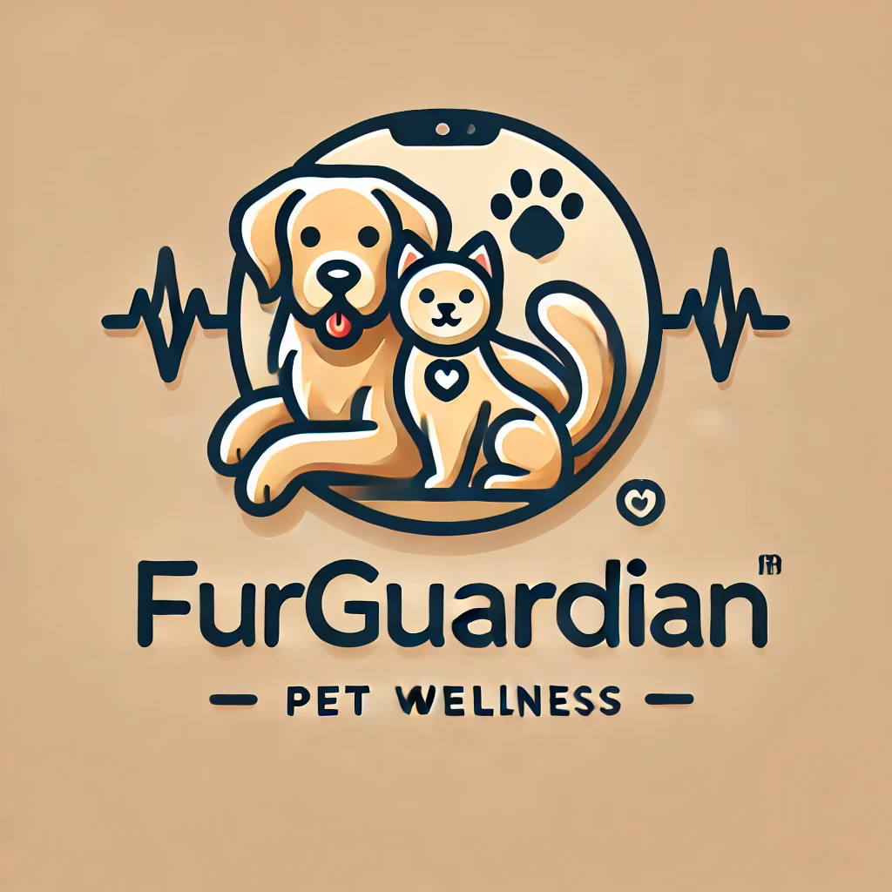

# FurGuardian App

## Intro
This app is used to interact with our remote monitoring and pet food device. 

### Team Members
Justin Chipman – N01598472
Imran Zafurallah - N01585098
Zane Aransevia - N01351168
Tevadi Brookes - N01582563
Mathew Anderson-Saavedra - N01436706

### Project Overview
The FurGuardian app is a comprehensive pet wellness platform designed for Android. 
It offers real-time pet monitoring, health tracking, feeding schedule management, and access to medical records. 
The app's user-friendly interface integrates cutting-edge technology like live video streaming, heart rate sensors, 
and remote food dispensing, making it easier for pet owners to care for their pets anytime, anywhere.

### Features
**Live Monitoring:** Stream live video and audio from your pet's environment, allowing real-time interaction.
**Health Monitoring:** Track key health metrics like heart rate, hydration, and activity levels.
**Feeding Schedule:** Remotely schedule and dispense food, check water levels.
**Medical Records:** Access your pet’s vaccination history, medical records, and more.
**Insights:** Educational content about pet care and nutrition.

### Project Image

### Project Link
[GitHub Repository](https://github.com/Chipman8472/FurGuardian.git)
